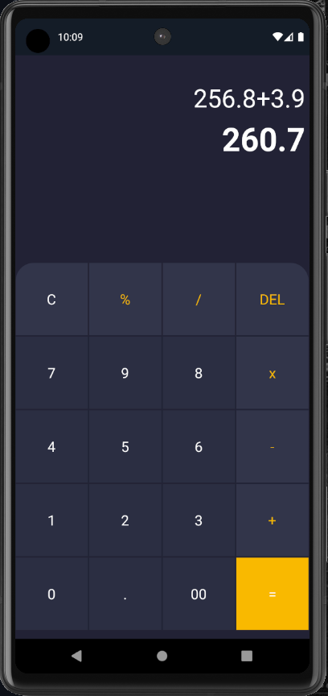

# UI Calculator

UI Calculator is a simple and user-friendly calculator app built using Flutter. It provides basic arithmetic operations such as addition, subtraction, multiplication, division, and percentage. The app uses the `math_expressions` package to parse and evaluate the mathematical expressions.

!UI Calculator Result

## Installation

Follow these steps to run the app on your local machine:

1. **Clone the repository**: First, clone this repository to your local machine using `git clone`.

2. **Get the packages**: Navigate to the cloned repository in your terminal and run `flutter pub get` to download all the necessary packages listed in `pubspec.yaml`.

3. **Run the app**: Finally, run `flutter run` to launch the app in debug mode.

Please note that you need to have Flutter SDK set up on your local machine before you can run this app.

## Features

- Basic arithmetic operations: addition, subtraction, multiplication, division, and percentage.
- Clear input and delete last entry features.
- Beautiful and minimalist user interface.

## Dependencies

- Flutter SDK: The Flutter SDK is required to build and run Flutter applications.
- Math Expressions: This package is used to parse and evaluate mathematical expressions.

We hope you enjoy using UI Calculator!
